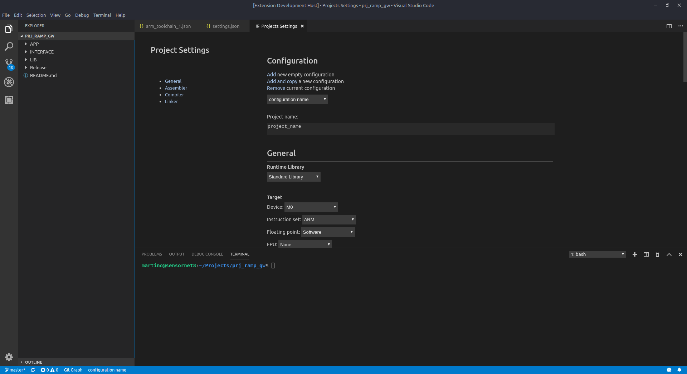

# Infos

This is not official ARM Extensions.

This is a basic ARM toolchain IDE with a simply UI for to config your Projects.

Note: For Now only cortex M, working with linux or with bash shell. 

Right click Project Settings UI

KeyBinds : CTRL+SHIFT+B build and clean, CTRL + B build